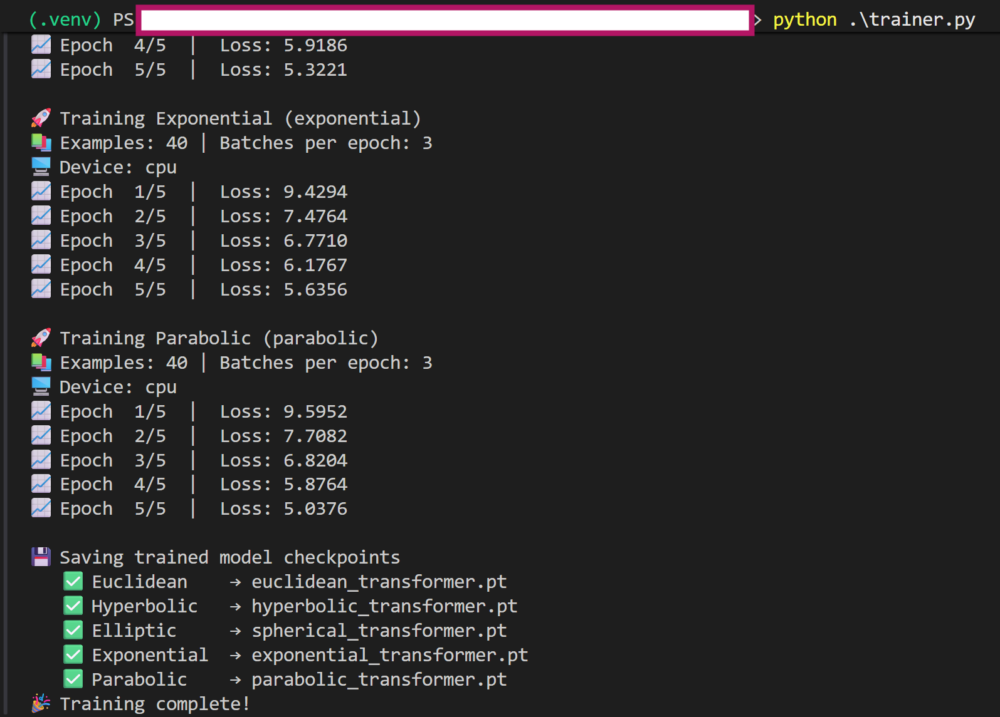
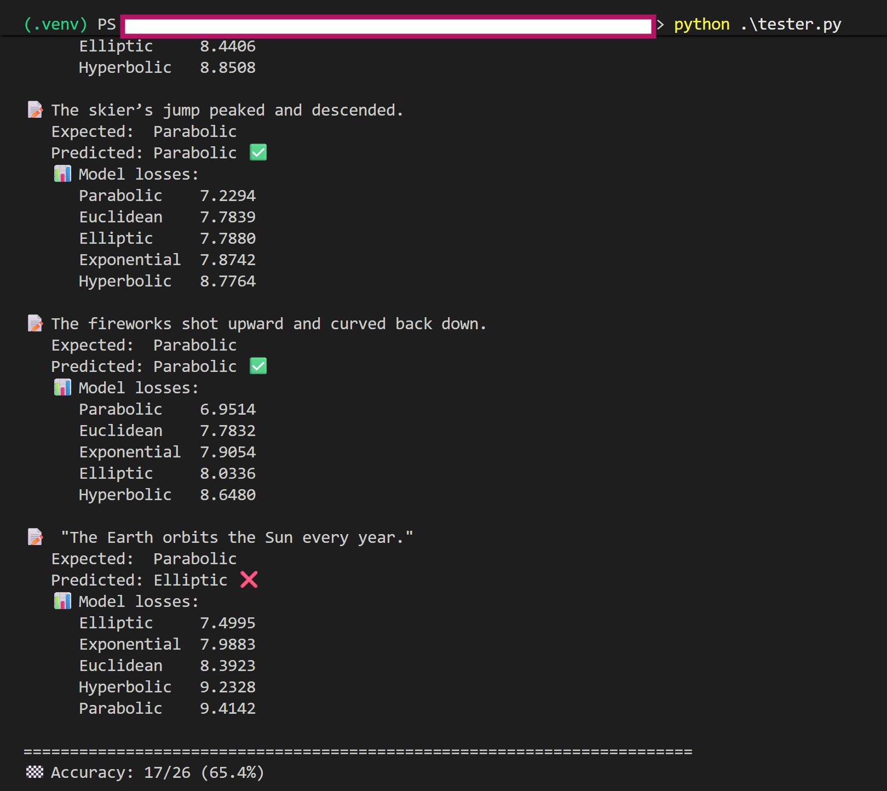
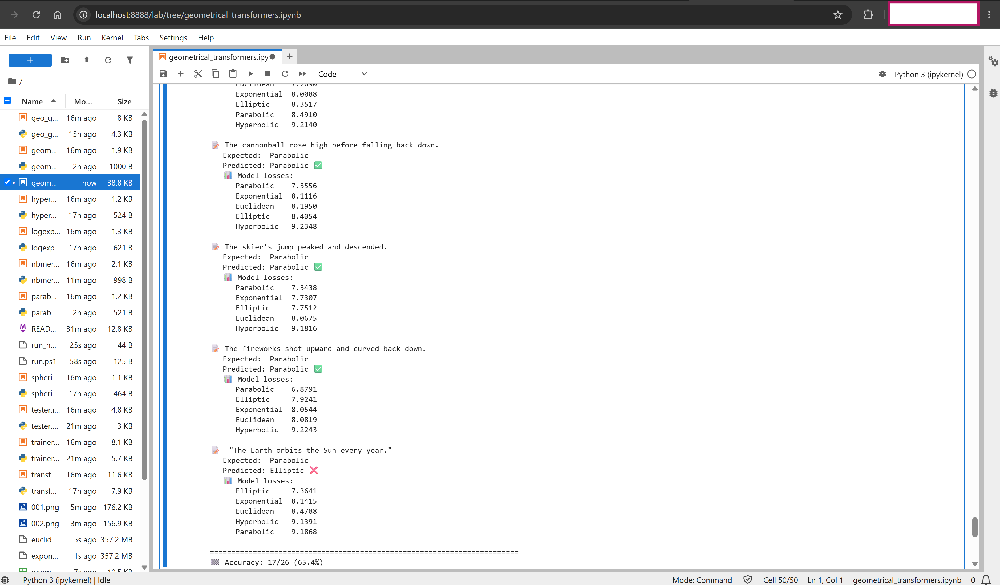

# Geometrical Transformers

An educational PyTorch project for comparing how simple transformations of token embeddings affect a shared encoder–decoder Transformer. Choose a geometry name when constructing the model; the Transformer architecture stays the same while its embedding layer changes.

> **Scope:** The names in this repository are useful labels for experiments, not evidence that every model implements a mathematically complete geometry. In particular, the hyperbolic, spherical, and parabolic variants apply simple operations to ordinary learned vectors. They do not implement geometry-aware attention, geodesic distances, or Riemannian optimization. Treat the project as a learning prototype, not a production text classifier or a validated comparison of geometric representation learning.

## What does “geometry” mean here?

A geometry is a way to describe points, distances, directions, and the shape of a space. A representation model turns tokens into vectors; changing the space or constraints on those vectors can make some relationships easier to represent. For example, a flat space is a natural general-purpose starting point, while a negatively curved space can represent a branching hierarchy compactly.

**Analogy:** Imagine arranging information on different kinds of maps. A flat street map, a globe, and a branching trail map each make different relationships easy to see. The map alone does not decide how a traveler moves or what route they take. Likewise, changing an embedding transform does not change the Transformer’s attention pattern or guarantee that a task will be solved better.


## The geometric ideas

- **Euclidean (flat):** The familiar flat space of vectors, where ordinary straight-line distance is used. It is the baseline and a general-purpose choice.
- **Hyperbolic (negative curvature):** A curved space with room that grows rapidly with distance from a central region. This makes it a promising representation for branching structures such as taxonomies and trees. A branching trail map is a useful mental picture.
- **Spherical / elliptic (positive curvature):** A bounded, sphere-like space. Direction and angular relationships are prominent. Think of positions on a globe. Spherical and elliptic geometry are related concepts, but not interchangeable names for every implementation.
- **Parabolic:** A mathematical term associated with a family of curves and conic sections, not a standard general-purpose embedding geometry in the same sense as Euclidean or hyperbolic space. A parabola-shaped trajectory is the usual visual analogy.
- **Exponential and logarithmic:** These describe functions or scaling patterns, not, by themselves, standard curvature categories alongside Euclidean and hyperbolic geometry. Exponential growth resembles a curve that becomes steep quickly; logarithmic growth resembles a scale that compresses large values.

These ideas suggest possible modeling choices; they do not imply that a given data type must use one geometry or that a geometry guarantees better performance. Applications require a task-appropriate representation and empirical evaluation.

## How the names map to code

The project uses the following simple transformations: Euclidean selects a regular embedding table; hyperbolic scales vectors into the unit ball; spherical normalizes vectors to unit length; parabolic squares coordinates; exponential applies `exp`; logarithmic applies `log(abs(x) + 1)`. The latter two are coordinate-wise nonlinear scalings. These operations are educational approximations, not complete implementations of the corresponding mathematical spaces.

As an analogy, these transforms are like changing how a map is drawn before using the same route-planning procedure. They can change the coordinates the model sees, but they do not change the model's attention rules or guarantee that a sentence will be understood differently in a useful way.

The repository offers six selectable embedding transforms:

| `geometry_type` | Operation in this repository | Intuition and possible fit | Important qualification |
| --- | --- | --- | --- |
| `euclidean` | Standard learned `nn.Embedding` vectors. | A flat sheet of graph paper: ordinary vector addition and distance are the baseline for general-purpose representations. | This is the unmodified embedding baseline; the Transformer still applies its usual learned attention and feed-forward layers. |
| `hyperbolic` | Divides each embedding by `1 + its L2 norm`, putting the result inside the unit ball. | A branching map whose available room grows toward the edge. Hyperbolic representations are often studied for trees, taxonomies, and other hierarchical data. | This is a radial projection inspired by the Poincaré ball model. The code does not calculate hyperbolic distance or use hyperbolic operations in attention. |
| `spherical` | Normalizes each embedding to unit L2 norm. | A globe: vectors lie on a sphere, so direction matters while vector magnitude is removed. Spherical representations can be a useful experiment when direction or angular similarity matters. | The code normalizes vectors; it does not implement a full elliptic-geometry model. |
| `parabolic` | Squares each embedding coordinate. | A simple curved response: larger magnitudes grow faster, while positive and negative values become indistinguishable. This can demonstrate the effect of a nonlinear embedding transform. | Element-wise squaring is not a general construction of parabolic geometry and discards sign information. |
| `exponential` | Applies `exp` to each embedding coordinate. | A volume knob with an accelerating response: small coordinate changes can produce large output changes. | This is coordinate-wise scaling, not exponential geometry or a model of growth in the data. Large values may also produce numerically large activations. |
| `logarithmic` | Applies `log(abs(x) + 1)` coordinate-wise. | A compressed ruler: large magnitudes are compressed, and the output changes more slowly as magnitudes increase. | This is a nonlinear rescaling, not logarithmic geometry. Taking the absolute value removes the sign of each coordinate. |

The operation details are implemented in [`geomapper.py`](./geomapper.py) and the individual embedding modules. The `logarithmic` option is available to the model API, but the default training and testing scripts do not currently include it in their configured experiments.

### Geometry is not the same as Transformer family

“Encoder-only,” “decoder-only,” “encoder–decoder,” and “vision Transformer” describe model architecture or input modality. “Euclidean,” “hyperbolic,” and “spherical” describe possible properties of a representation space. These are separate design choices: this repository does not implement BERT, GPT, T5, ViT, or a graph Transformer. It defines one small encoder–decoder Transformer and varies its embedding transform.

For a more formal conceptual overview of the geometric terms, see [`geometry.md`](./geometry.md).

## How the model works

The main implementation is [`transformer.py`](./transformer.py):

1. **Token embeddings:** `map_2_geometry(...)` converts token IDs into vectors using the selected embedding layer.
2. **Positional encoding:** fixed sine and cosine signals are added so the model can distinguish token order. Like track numbers on a playlist, they tell the model where each token occurs.
3. **Encoder stack:** self-attention lets each source position combine information from other source positions. Multiple heads act like several readers attending to different relationships.
4. **Decoder stack:** masked self-attention processes target positions, and cross-attention can consult encoder output. The caller must supply suitable masks; the model does not construct a causal mask automatically.
5. **Output projection:** a linear layer produces one vocabulary-sized vector of logits per target position. These are scores for the next-token vocabulary, not decoded words or a geometry-class label.

The model returns logits with shape `(batch_size, target_length, target_vocab_size)`. The example and trainer use token IDs from the uncased BERT tokenizer, but the model itself is a custom PyTorch implementation.

## Repository contents

| File | Purpose |
| --- | --- |
| [`transformer.py`](./transformer.py) | Positional encoding, attention, encoder/decoder layers, and the configurable Transformer. |
| [`geomapper.py`](./geomapper.py) | Maps each supported geometry name to its embedding module. |
| [`hyperbolic.py`](./hyperbolic.py), [`spherical.py`](./spherical.py), [`parabolic.py`](./parabolic.py), [`logexp.py`](./logexp.py) | The embedding transforms used by the mapper. |
| [`trainer.py`](./trainer.py) | Loads labeled sentences, trains the configured models, and saves their state dictionaries. |
| [`tester.py`](./tester.py) | Loads saved models and ranks geometry labels by token-prediction loss. |
| [`geo_generator.py`](./geo_generator.py) | Generates the synthetic training CSV. |
| [`geometry_sentences.csv`](./geometry_sentences.csv) | Training examples, grouped under geometry-inspired labels. |
| [`geometry_test_sentences.csv`](./geometry_test_sentences.csv) | Small set of examples used by the test script. |
| `*_transformer.pt` | Saved PyTorch weights, when generated locally. These files are ignored by Git and are not required to understand the source. |

## Quick start (PowerShell)

Run these commands from the repository root in PowerShell.

### Train models and evaluate them

```powershell
.\run.ps1
```

This script creates the `.venv` virtual environment, activates it for the script, installs the packages in `requirements.txt`, then runs `trainer.py` followed by `tester.py`. Training saves the model checkpoints that the tester needs. The first run may need network access to download the BERT tokenizer.

### Open the Jupyter notebook

The notebook launcher uses JupyterLab, which is not included in `requirements.txt`. Install it into the project virtual environment once, activate that environment in the current PowerShell session, then start the notebook:

```powershell
python -m venv .venv
.\.venv\Scripts\Activate.ps1
python -m pip install -r .\requirements.txt
python -m pip install jupyterlab ipykernel
.\run_notebook.ps1
```

The launcher opens `geometrical_transformers.ipynb` in JupyterLab. Keep the virtual environment activated while JupyterLab is running so the notebook can use the project's installed packages. If `.venv` is already set up, skip the `python -m venv .venv` command.

## Install and run

Use Python with the packages listed in [`requirements.txt`](./requirements.txt). From the repository root:

```powershell
python -m pip install -r requirements.txt
python trainer.py
python tester.py
```

The tokenizer is loaded with `BertTokenizer.from_pretrained("bert-base-uncased")`; the first run may need network access to download its tokenizer files. Training uses the default model size in `transformer.py` (512-dimensional embeddings, 8 attention heads, 6 encoder layers, and 6 decoder layers), so a run can take a while and benefits from a supported GPU.

`trainer.py` trains and saves Euclidean, hyperbolic, spherical, exponential, and parabolic models. The data label `Elliptic` is mapped to the implementation name `spherical`. The script does not train a logarithmic model. `tester.py` expects the five corresponding checkpoint files in the current directory; it compares each model’s next-token loss and predicts the label with the lowest loss.

To use the model in your own Python code:

```python
import torch
from transformer import Transformer

model = Transformer(
    src_vocab_size=30_522,
    tgt_vocab_size=30_522,
    d_model=64,
    num_heads=4,
    num_layers=2,
    d_ff=256,
    geometry_type="hyperbolic",
)

src = torch.randint(0, 30_522, (2, 5))
tgt = torch.randint(0, 30_522, (2, 4))
logits = model(src, tgt)
print(logits.shape)  # (2, 4, 30_522)
```

The vocabulary sizes must match the tokenizer or vocabulary used to create the input IDs. Supply `src_mask` or `tgt_mask` when your task requires padding or autoregressive masking. For autoregressive decoding, the target mask should prevent each position from attending to later target positions.

## What the training and test scripts demonstrate—and do not

Training is a small next-token prediction experiment over sentences whose labels were assigned from geometry-inspired themes (for example, hierarchy-themed sentences for `Hyperbolic`, or recurring events for `Elliptic`). This makes it possible to compare whether different embedding transforms fit this particular setup.

There are important limits to interpreting the reported result:

- The CSV is synthetic and small; its themes and repeated templates can make labels easier to associate with wording than with any underlying geometry.
- In the current trainer, the encoder receives only the first source token (`input_ids[:, :1]`), while the decoder receives the shifted sentence. This is a prototype training arrangement, not a full source-to-target translation setup.
- The tester is not a separately trained geometry classifier. It chooses the model with the lowest token-prediction loss on a sentence. That score is only a rough comparison on these examples and is not a calibrated probability or evidence of generalization.
- The results do not establish that a geometry is universally best for the suggested application. A meaningful comparison needs an appropriate dataset, well-defined geometric operations throughout the model, controlled training, and suitable task metrics.

## Where to explore next

- Change `geometry_type` when constructing `Transformer` to compare the embedding modules under the same architecture.
- Inspect `map_2_geometry` to see how a geometry name selects an implementation.
- Adapt the data, masks, and training objective to a concrete task before interpreting performance.
- If adding a new embedding transform, implement it as a PyTorch module and register it in `geomapper.py`.

## Gallery

* Trainer Stage

* Testing Stage

* Jupyter Lab Notebook Execution


That's It!!! <br/>
Happy Exploring!!! <br/>
Cheers!!! <br/>
:-)
